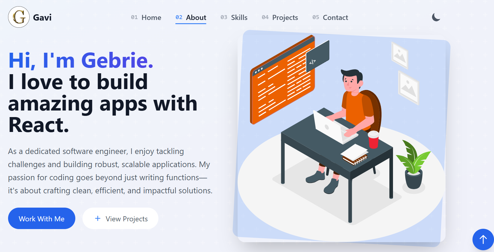

# Peak Portfolio

A modern, professional developer portfolio built with **Next.js 15**, **TypeScript**, and **Tailwind CSS**. Showcasing projects, skills, achievements, and interactive tools in a beautiful, responsive UI.



---

## ✨ Features

- **Hero Section**: Eye-catching introduction with animated SVG and social links
- **About Me**: Timeline of experience, education, and a personal summary
- **Skills**: Interactive skill bars for frontend, backend, and tools/cloud
- **Projects**: Filterable, visually rich project cards with live demos and GitHub links
- **Professional Showcase**: Tabs for Resume Analyzer, Code Playground, Performance Metrics, Tech Stack, and Achievements
- **Blog**: Section for latest posts (extendable)
- **Contact**: Animated contact form and direct info
- **Visitor Counter**: Real-time visitor stats
- **Dark/Light Theme**: Toggle with smooth transitions
- **3D & Animations**: Framer Motion, Three.js, and glassmorphism effects

---

## 🚀 Tech Stack

- **Framework**: Next.js 15, React 18, TypeScript
- **Styling**: Tailwind CSS, custom themes, glassmorphism
- **UI/UX**: Radix UI, Framer Motion, Lucide Icons
- **Data & State**: React Hook Form, Zod, useState, useEffect
- **3D/Animation**: Three.js, @react-three/fiber, @react-three/drei
- **Other**: Vercel (deploy), Docker (optional), MongoDB/PostgreSQL (for fullstack projects)

---

## 📦 Getting Started

1. **Clone the repo:**
   ```bash
   git clone https://github.com/yourusername/peak-portfolio.git
   cd peak-portfolio
   ```
2. **Install dependencies:**
   ```bash
   npm install
   # or
   pnpm install
   ```
3. **Run the development server:**
   ```bash
   npm run dev
   # or
   pnpm dev
   ```
   Open [http://localhost:3000](http://localhost:3000) to view it in your browser.

---

## 🛠️ Customization

- **Edit your info:**
  - Update content in `components/about-section.tsx`, `components/skills-section.tsx`, and `components/projects-section.tsx`.
  - Add your social links in `app/page.tsx` and `components/contact-section.tsx`.
- **Add projects:**
  - Edit the `projects` array in `components/projects-section.tsx`.
- **Blog posts:**
  - Add markdown or dynamic content in `app/blog/`.
- **Professional tools:**
  - Customize tabs and tools in `app/professional/page.tsx` and related components.

---

## 📸 Screenshots


---

## 📄 License

MIT License. Feel free to use, modify, and share!

---

## 🙋‍♂️ Author

**Gebrie Wagnew**  
Adama, Ethiopia  
[LinkedIn](https://linkedin.com/in/yourusername) • [GitHub](https://github.com/yourusername) • [Twitter](https://twitter.com/yourusername)

---

## ⭐️ Show your support

Star this repo if you like it, and feel free to contribute or open issues! 